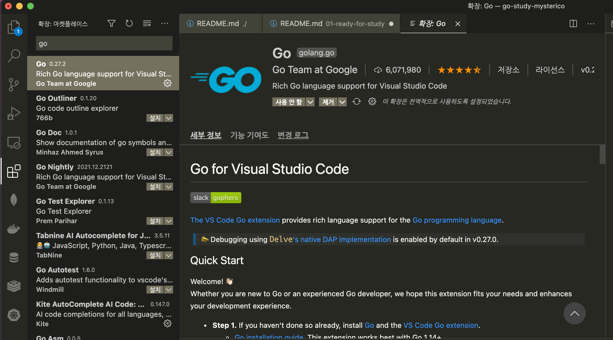

# 01 Ready For Study
Go 언어로 개발하기 위한 준비 단계를 알아 봅시다!

# 환경 구성
## IDE
해당 스터디는 IDE로 VsCode를 이용하여 개발합니다.   
* [VsCode 다운로드 링크](https://code.visualstudio.com/download)
## Go 다운로드
Go언어 다운로드 페이지로 가서 Go언어를 설치해줍니다.
* [Go 다운로드 링크](https://go.dev/dl/)
## Extension
VsCode에 Go언어 Extension을 설치하여 VsCode에서 Go문법을 인식할 수 있도록 합니다.   

## 설치 확인
```shell
$ go version
```
output
```
go version go1.17.5 darwin/amd64
```
# 시작하기
Go언어 프로젝트를 실행하려는 Directory에서 터미널에 명령어를 입력합니다.
```shell
touch hello-world.go
```
`main.go` 파일이 생성되면 오른쪽 하단에 추가 설치 Alert가 생성되는데 모두 설치해주도록 합시다.
## Hello World!
생성된 파일에 아래의 코드를 입력하여 hello world를 출력해봅시다.
```go
package main

import "fmt"

func main() {
	fmt.Println("hello world!")
}
```
```shell
$ go run hello-world.go
```
output
```
hello world!
```
### Compile & Build
컴파일 및 빌드를 진행하면, 빌드된 파일이 떨어져 나옵니다.
```shell
$ go build hello-world.go
$ ./hello-world
```
output
```
hello world!
```