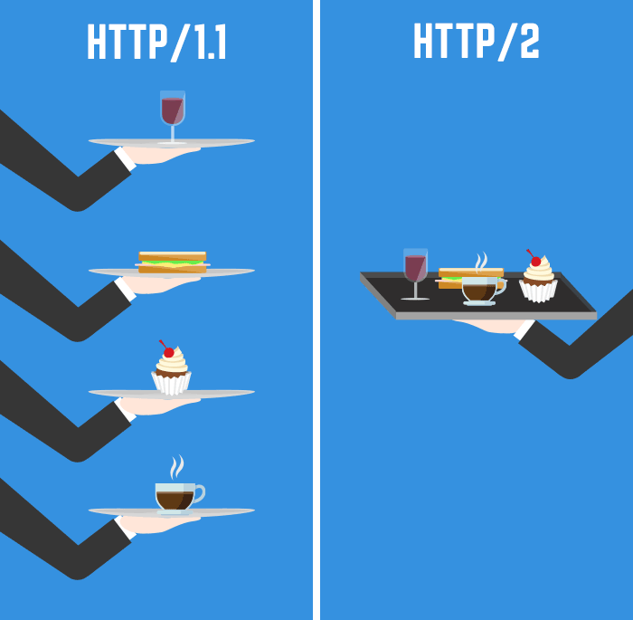

# 02 Why Study Go Language   
우리는 왜 Go 언어를 배워야할까요??   
모든 배우는 것은 좋지만, 무작정 시작하는게 아니라 왜? 무엇을 위해? 배우는지 알아야 합니다.   
Go가 가진 장점과 단점을 파악해보고, 공부를 시작하도록 합시다.

# 프로그래밍 언어의 역사
* 1960~1980
    - C
    - SQL
* 1980년 대
    - C++ (1980)
    - MATLAB (1984)
    - Objective-C (1986)
* 1990년 대
    - Python (1991)
    - HTML (1991)
    - Ruby (1993)
    - Java (1995)
    - JavaScript (1995)
    - PHP (1995)
* 2000년 대 이후
    - C# (2001)
    - .NET (2001)
    - Scala (2003)
    - Go (2009)
    - Dart (2011)
    - Swift (2014)
    - Rust (2015)

# 기술이 바라보는 것
## 과거의 언어
대부분의 프로그래밍 언어는 90년대 이전에 개발되었다.   
2000년대 전에는 하드웨어 시장에서 **단일 코어의 성능을 업그레이드** 시키는데 집중하였다.   
(무어의 법칙.. 2년마다 CPU성능 2배증가 뭐 그런)   
그렇기 때문에 소프트웨어도 단일코어를 잘 사용할 수 있게 개발되었다.   

최근 하드웨어 시장의 추세는 *싱글 코어* 보다는 *멀티 코어*, *하이퍼 쓰레드* 기능을 통해 성능을 향상시키고 있다.   
`Java`나 `Python`은 90년대 **단일 스레드 환경에서 사용되는 언어**였으므로 멀티 쓰레딩 프로그래밍이 복잡하다.    
예를 들면, 파이썬의 대표적인 한계로 꼽히고 있는 *GIL*때문에 멀티 코어에서 최적화된 프로그래밍이 불가능하다.
물론 불가능한 것은 아니지만 뮤텍스와 스레드, 데이터를 점유하는 경쟁 구조를 프로그래머가 직접 설계해야 하므로 다소 복잡하다.    
[뮤텍스와 세마포어 참조 링크](https://worthpreading.tistory.com/90)
<details>
<summary>뮤텍스와 세마포어</summary>  
<code style="white-space:nowrap;">
뮤텍스: 한 쓰레드, 프로세스에 의해 소유될 수 있는 Key🔑를 기반으로 한 상호배제기법   
   
세마포어: Signaling mechanism. 현재 공유자원에 접근할 수 있는 쓰레드, 프로세스의 수를 나타내는 값을 두어 상호배제를 달성하는 기법      
</code>
</details>

## 마이크로 서비스 아키텍쳐 (MSA)
최근 가장 흔하게 들을 수 있는 `MSA` 는 위에 써있는 과거의 언어가 걸어온 길과 연관성이 있다.   
`MSA`는 `모놀리틱 시스템 구조`에서 서비스를 작은 단위로 쪼개고 독립적이게 구성한 것이다.   
예를 들면 `Node.js`로 채팅서버를 작성하고, `Python`으로 ML서버를 작성하는 느낌(?)으로 볼 수 있다.    
   
즉, 최근에는 Scale-up을 하는데에 한계를 느끼고 있고 점점 Scale-out으로 시대 흐름이 변하고 있다는 것.     

## 빅 데이터 시대
`빅 데이터` 라는 말도 요즘 많이 들리는데, 아니 요즘이라기엔 이제는 들린지 너무 오래 되어 버린듯 하다.   
`빅 데이터`는 말 그대로 엄청나게 많은 양의 데이터를 말하는데, 네트워크 시대에 진입하면서 데이터들은 지속적으로 쌓여져 왔고, 이런 데이터들을 활용하는 것은 요즘엔 흔한 일이 되었다.   
   
하나의 예를 들면, 비가오는날 저녁에 유튜브알고리즘이 노래를 추천해주었는데, 그게 `Raindrop - IU` 이었다고 치자.   
이 결과는 어떻게 나왔을까? 정답은 아니겠지만 이렇게 생각해볼 수 있다.
1. 나의 활동 로그 : 내가 혹시 IU를 검색하거나, RainDrop 커버를 듣진 않았나?
2. 유저의 활동 로그 : 나와 비슷한 노래취향을 가진 사람들은 어떤 노래를 들었을까?
3. 날씨 데이터 : 비가 오는 날에 사람들이 많이 들었던 노래는 무엇일까?
4. 시간대 데이터 : 아침부터 저녁까지 시간대별 사람들이 듣고 있는 노래는 무엇일까?
5. 노래의 데이터 : 추천할만큼의 좋은 노래라는 지표들을 가지고 있을까? 

하나의 종목만 해도 엄청난 데이터일텐데, 이것들을 전부 모아서 하나의 결과를 내고 그 결과가 나에게 실시간으로 추천이 될 수 있는 방법은 무엇일까?   
     
물론 추천 알고리즘을 어떻게 구성했느냐도 중요하지만, 결국 다양한 `빅 데이터`들을 통해 결과를 이끌어 내기 위해 데이터를 빠르게 처리할 수 있고, 실시간으로 분석결과를 낼 수 있어야 한다.   
    
그렇다면 필요한건 3가지 `eco-system`과 `병렬 처리 프로세싱` 이다.   
대표적으로는 `Apache Spark`가 그 중심에 서 있다. 그리고 Spark는 Java기반이다.

## 컨테이너 & 클라우드
컨테이너기반의 배포, 클라우드를 통한 서비스 및 관리 또한, 대세중의 대세로 떠오르고 있다.   
컨테이너는 이미지를 통해 환경에 구애를 받지 않고 프로그램이 동작할 수 있도록 한다.   
Java는 이런 컨테이너 환경이 없던 시절이므로, JVM을 통해 이걸 해결하고자 했다.   
Python 역시 인터프리터 언어로써, 한단계 거쳐서 프로그램이 실행된다.   
하지만, 이는 컨테이너 시대에는 잘 어울리지 않는다.   
컨테이너 위에서 JVM이 또 설치 되어야하며, Python은 인터프리터가 없으면 Python은 그냥 Text파일일 뿐이다.   

클라우드는 물리적 공간이 필요했던 베어메탈서버들의 단점들을 해결해 주었다.   
이러한 부분 덕에 요즘은 클라우드 기술을 통해 서비스하는 것이 일반화 되었다.   
하지만, 클라우드의 요금에 문제에 부딫히면서 마냥 Scale-up을 하지않고, MSA구조를 채택하는 기업이 많이 늘었다.   
MSA구조를 채택하는 만큼 네트워크지식과 기술이 더 필요해지게 되었다.   

# Go 언어의 특징
## 빠른 속도
Go는 C/C++보다 훨씬 빠른 컴파일 속도를 가진다.    
또 이진 파일로 컴파일되고 자바와 같은 가상 시스템이 필요하지 않다는 장점이 있다.    
Go는 교차 플랫폼 언어로 Windows, Linux, macOS 등 모든 플랫폼에서 개발할 수 있다.    

Go는 가장 빠르고 효율적인 프로그래밍 언어 중 하나로 워크로드를 처리하는 방식은 PNP, Node.js 루비(Ruby) 등 인터프리터 언어와 비교할 수 없을 정도이다.    
### 벤치 마크
그렇다면 벤치 마크를 한번 확인해 보자.
벤치마크 구성 환경
* PHP v5.4.16; Apache v2.4.6
* Java (OpenJDK) 1.8.0_131-b11; Tomcat v7.0.69 (without APR/native)
* Node.js v6.10.3
* Go v1.8.1

300개의 동시 요청에 2000회를 반복하며 연결 수(N)이 1일 경우   
   
시간이 빠른 순서로 Go > Java > PHP > Node    
    
300개의 동시 요청에 2000회를 반복하며 연결 수(N)이 1000일 경우 
    
시간이 빠른 순서로 Go > PHP > Java > Node    

연결 수(N)가 1이고 시간당 처리할 수 있는 요청의 수
  
처리량이 많은 순서로 Go > Java > Node > PHP    

### 왜 빠를까?
`Java`는 *JVM*을 통해 실행되며 `Python`은 *스크립트 언어*로 인터프리터에 의해 해석되며 실행되기 때문에 **실행을 위해 브리지나 해석하는 단계**를 거쳐야 한다.   
그러므로 직접 CPU를 돌리며 필요한 코드를 실행하는 네이티브 언어에 비해 느릴 수밖에 없다.    
Go는 C, C++과 동일하게 **바이너리로 직접 컴파일되**므로 다른 최신 언어에 비해 좋은 성능을 발휘(저 수준 언어에 가까움) 한다.     
하지만 C, C++과 다르게 가비지 수집을 사용하여 자동으로 개체를 할당하고 제거하므로 malloc이나 free가 필요 없는 것도 장점이다.

## GoRoutine
Go 언어는 최근에 출시한 언어답게 멀티쓰레딩 기술을 자체적으로 가지고 있고, 굉장히 편하게 쓸 수 있다.   
`GoRoutine` 이라는 이름을 가지고 있는데, 아래의 특징을 보자.  
* 내장된 기본 요소가 제공되어 자체적으로 안전한 통신 사용
* 통신을 하는 구조이기 때문에 데이터 구조를 공유할 때 뮤텍스 잠금에 의존하지 않음
* GoRoutine과 OS 스레드에는 1:1 매핑이 없으므로 최적화된 다수의 스레드에서 실행
* 일반적인 쓰레드를 사용하는것 보다 속도 성능이 우수하다고 한다. 
* 최적화된 스레드란?
    * JAVA와 같은 언어에서 스레드 생성시 약 2MB 메모리 공간이 신규로 할당된다. 
    * Go-routine의 경우 1KB를 차지한다.
    * 2000배 가까운 메모리 용량 차이는 메모리 할당시 더 오랜 시간이 걸리고 및 페이지 교체가 더 빈번하게 일어나 오버헤드가 증가함으로 이어진다.
* 시스템 자원을 상당히 절약하며 Golang 런타임은 수천 개의 Go 루틴을 동시에 실행할 수 있게 한다.
* 인프라 유지 보수 비용도 저렴해 호스팅 비용이 저렴

즉, GoRoutine이란 Go언어가 가지고 있는 자체적인 멀티스레딩 기법이고, 최적화를 굉장히 잘시켰다고 할 수 있다.   
이러한 부분은 현대의 하드웨어와 잘맞으며, 동시성이 중요한 back-end 작업과 Data processing에 잘 적응할 수 있는 결과라고 볼 수 있다.

## 중앙집중형을 따르지 않음
* Go언어의 라이브러리는 Github의 코드를 직접 import하며 사용할 수 있다.
* Go언어 초기에는 사용할 수 있는 라이브러리가 별로 없었지만 10년 정도 지나면서 꽤나 성숙한 라이브러리도 출현하고 있다.
* Java의 경우 Maven repository를 통한 패키지 관리를 중앙집중식으로 하였지만, Go언어는 Github을 이용하면서 중앙집중에 대한 의존성을 없앴다.

## Back-end와의 통합
Go 언어는 현재 구성되어 있는 Java로 구성된 Back-end 시장에 진출하기 위해 통합적인 부분을 매우 신경썼다.   
즉, 현재의 시스템에도 Go로 만든 서비스를 쉽게 추가하고 통신할 수 있다.   
이러한 이유로 Go언어는 MSA시장을 새로운 패러다임으로 만들어내고 있다.   
Java, Python, JS, PostgreSQL, MySQL, Redis, GraphQL등 라이브러리를 통해 쉽게 통합이 가능하다.

## GRPC
GRPC는 Protobuf를 사용하는 HTTP2 통신이다.   
Protobuf는 구글에서 지정한 프로토콜 버퍼인데, Payload로 binary를 이용한다.   
Go언어에서 사용하는 주된 통신이 바로 GRPC이다.   
이 GRPC를 통해 마이크로 서비스들이 서로 원활하게 통신할 수 있다.   
(대표적으로 쿠버네티스는 GRPC통신을 주로 이용한다. Docker와 K8s는 애초에 Go로 만들어짐)   
* `마이크로 서비스`: gRPC는 대기 시간이 짧고 처리량이 높은 통신을 위해 설계되었습니다. gRPC는 효율성이 중요한 경량 마이크로 서비스에 적합합니다.
* `지점 간 실시간 통신`: 양방향 스트리밍을 위한 뛰어난 지원 기능을 제공합니다. gRPC 서비스는 폴링을 사용하지 않고 실시간으로 메시지를 푸시할 수 있습니다.
* `Polyglot 환경`: gRPC 도구는 널리 사용되는 모든 개발 언어를 지원하며, 따라서 gRPC는 다중 언어 환경에 적합합니다.
* `네트워크 제한 환경`: gRPC 메시지는 경량 메시지 형식인 Protobuf를 사용하여 직렬화됩니다. gRPC 메시지는 항상 해당하는 JSON 메시지보다 작습니다.
* `IPC(프로세스 간 통신)` : Unix 도메인 소켓 및 명명된 파이프와 같은 IPC 전송은 gRPC에서 동일한 머신에 있는 앱 간에 통신하는 데 사용할 수 있습니다. 자세한 내용은 gRPC와 프로세스 간 통신를 참조하세요.
### HTTP vs HTTP2
HTTP는 Request와 Response를 중점으로 통신한다.   
HTTP는 연결성을 중점으로 통신한다고 볼 수 있다.   

   
좀 더 자세한 그림으로 보자.   
   

* HTTP (1999)
    * 하나의 연결은 무조건 1개 요청과 응답으로 처리됨 (다시 새로운 연결)
    * 서버는 클라이언트의 요청없이는 통신을 할 수 없다.
    * 헤더의 크기가 크다. (실제 데이터보다 헤더가 큰 경우도 많다.)
    * 헤더의 쿠키를 통해 연결성을 가질 수 있게 트릭을 사용하기 때문에 매번 똑같은 쿠키를 헤더에 담아서 통신의 낭비가 일어난다. (다른 메타 정보도 마찬가지)
    * HTTPS가 있기는 하나 HTTP통신은 사람이 읽을 수 있는 형태이기에 보안적으로도 좋지 않다.
* HTTP2 (2015)
    * HTTP2를 지원하지 않는 브라우저에서는 불가능
    * Multiplexed Streams을 통해 하나의 연결을 통해 여러개의 요청 및 응답을 주고 받는다.
    * Stream Prioritization는 리소스간 우선순위를 설정하여 클라이언트가 필요한 리소스부터 먼저 전송한다.
    * HTTP2는 연결이 되어있다면 서버측에서 리소스를 먼저 보내줄 수 있다.
    * HTTP2의 헤더는 HPACK으로 압축되어 전송한다. (리소스 사용량 감소)
    * HTTP2도 보안강화로 SSL/TLS를 사용할 수 있다.

### protobuf
Protobuf는 구글에서 만든 프로토콜 버퍼인데 GRPC에서 사용하는 IDL이다.   
IDL (interface definition language)는 정보를 저장하는 규칙을 뜻한다.   
HTTP통신에서는 대표적으로 XML과 JSON이 있다.   
XML과 Json은 사람이 읽을 수 있는 구조이지만, Protobuf 통신은 통신간의 서버가 가지고 있는 프로토콜 규칙을 볼수 없다면 binary이기 때문에 사람이 읽을수 없다.   

```go
// address.proto
syntax = "proto3";
package com.terry.proto;

message Person{
  required string name = 1;
  optional int32 age=2;
  required string email=3;
}
```
위 코드는 protobuf의 작성 방식인데 데이터 스키마를 구성하는것과 같다.   
JSON에 비하면 규격이 엄격해서 사용성이 좋다고 할수는 없다.   
```python
# server_data.py
import address_pb2

person = address_pb2.Person()

person.name = 'Terry'
person.age = 42
person.email = 'terry@mycompany.com'

person.SerializeToString()
```
```javascript
// client.js
let client = new adress_proto.Employee(
    'localhost:4500',
    grpc.credentials.createInsecure()
);
let employeeName = 'Terry';
client.getPerson({name: employeeName}, function(err, response) {
    console.log('Person:',employeeName,'\n' ,response.message);
});
```
## 단점
* 없는게 산더미입니다.
    * 제네릭 문법 없음. 
    * 클래스 문법 없음(OOP 안녕~)
    * 예외 처리 문법 없음
    * Public, Private 키워드 없음, this 문법 없음
    * 덱과 같은 자료형이 제공되지 않습니다.
* 코드가 깔끔해 지지 못합니다.
    * 예외 처리 문법이 없기에 if 문이 상당히 많이 사용됩니다. 읽기 힘든 지저분한 코드가 생깁니다.
* 좋은 IDE가 없습니다.
    * C는 DEV C++, Visual Studio 등등, Java의 이클립스,intelliJ가 있지만 Go는 VS Code, Goland 말고 별다른 선택지가 없습니다.
* verbose 한 코드
    * Go는 템플릿도 매크로도 없습니다.
    * 이는 Go의 코드를 단순하게 만들어주는 장점도 있지만, 하지만 템플릿도 매크로도 없어서 단순한 코드가 반복해서 등장합니다.
* 중앙 저장소의 부재
* 강력한 라이브러리 부재
    * GORM 등 있지만 JPA나 Django ORM 보다 아쉽습니다.
    * 파이썬의 Django, Flask와 같이 지배적인 라이브러리가 있는 것이 아니라 고만고만한 Echo, Gin, Beego 프레임워크가 있습니다.
* 버전관리
* 코드를 작성하면 formatter가 코드를 수정하는데 단순히 공백이 추가된 것을 git에서 수정된 라인으로 잡을 때가 있습니다. 커밋의 호읍이 길다면 실제 수정된 로직을 파악하기는 힘들어집니다.
* 우리나라 한정.. Go를 도입한 회사가 많이 없습니다.
    * 자바 진형이 대세인 우리나라에서는 타 언어에 비해서 인럭풀이 많지 않습니다.
    * 하지만 Go의 빠른성능, 빅쿼리 등등의 이유로 도입하는 회사가 있습니다.

## 단점 (나무위키 작성본 추가)
바이트코드를 생성하는 언어가 아니므로, 바이너리만 배포할 경우 C/C++ 프로그램이 그렇듯 해당 타깃 머신에 맞춰서 각각 컴파일해야 한다.    
그렇게 하지 않고서 다중 플랫폼을 지원하려면 소스 코드째로 배포해야 한다.   
   
Go 언어의 설계 지향점은 시스템 프로그래밍 언어였지만, 가비지 컬렉션의 지원이나 제네릭의 부재로 인해 박싱/언박싱이 불필요하게 많이 일어나는 등 C/C++을 대체할 수 있는 언어는 아니라는 것에 합의가 이루어지고 있는 상황이다.    
실제로 고성능 연산에 사용하기에는 C/C++에 비해 느리며, 저수준 시스템 개발에서는 가비지 컬렉션과 고루틴을 지원하기 위한 무거운 런타임 등으로 인해 사용이 불가능에 가깝다.   
그런 이유로 대체로 개발 속도와 실행 속도, 병행성 사이의 적정 지점이 필요한 서버 애플리케이션 개발에 많이 사용되는 편.

또 다른 비판점 하나로는 현대 프로그래밍 언어 연구의 성과를 일체 무시한 언어 설계.     
많은 종류의 프로그램 버그는 프로그래밍 언어 차원에서 원천적으로 차단될 수 있으며, 프로그래밍 언어 연구자들은 쓰기 쉬우면서도 최대한 많은 버그를 컴파일 시점에 잡을 수 있는 타입 시스템을 만드는 데 많은 노력을 기울이고 있다.    
하지만 이런 노력들이 무색하게 Go에서는 널 포인터나 안전하지 않은 타입 캐스팅의 유발 등 수많은 버그의 원천들에 전혀 손을 대지 않았다는 것.    
물론 단순성을 중시하는 Go의 철학상 최첨단 연구 성과들을 즉시 도입하는 데에는 무리가 있겠지만, 3~40년 전의 연구를 기반으로 최근 업계에서 당연하게 여겨지는 원칙들조차 전혀 고려하지 않았다는 것은 수많은 사람들에 의해 비판받은 바 있다.    
이에 대해 구글은 제네릭을 지원하면 코드가 더 간결해지지만 Go는 지금도 코드가 긴 편이 아니고, 컴파일 속도와 실행속도가 느려지기 때문에 아직 지원하지 않는다고 밝힌 적이 있다.    
현재는 일반화 프로그래밍을 지원하기 위해 협의 중이며 빠르면 2022년 2월에 나올 Go 1.18 버전에서 지원될 것이다.

### 참조 링크
https://m.blog.naver.com/isc0304/221861659555   
https://m.blog.naver.com/dsz08082/221970891331   
https://velog.io/@leejh3224/%EB%B2%88%EC%97%AD-%EC%84%9C%EB%B2%84-IO-%EC%84%B1%EB%8A%A5-%EB%B9%84%EA%B5%90-Node-vs-PHP-vs-Java-vs-Go   
https://www.codingworldnews.com/news/articleView.html?idxno=5643   
https://pronist.tistory.com/67  
https://velog.io/@jerry92/%EC%A7%80%EA%B8%88%EC%9D%80-Go%EB%A5%BC-%EB%B0%B0%EC%9B%8C%EC%95%BC%ED%95%A0%EB%95%8C