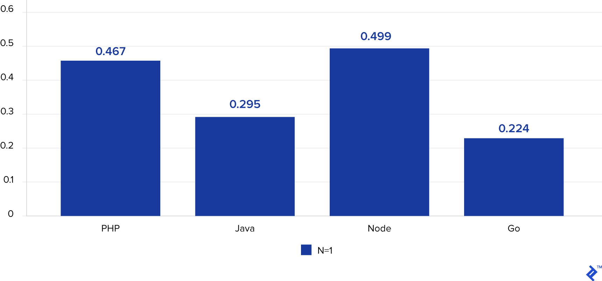
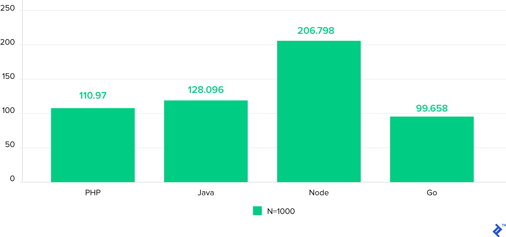
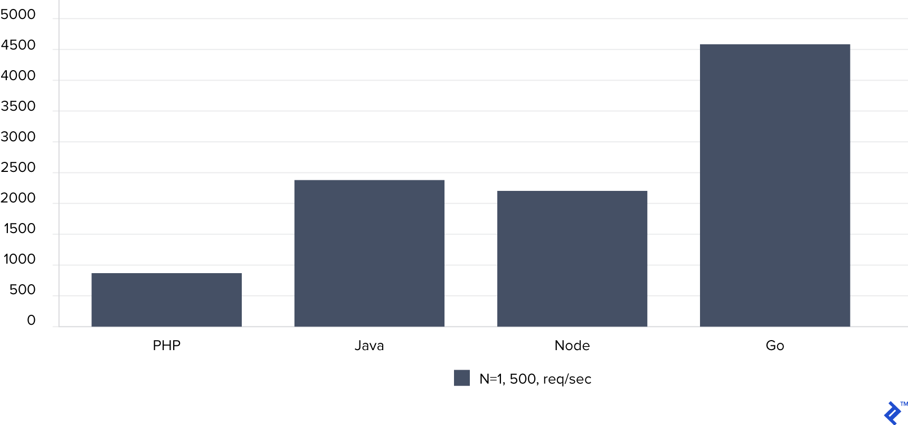

# Why Study Go Language   
우리는 왜 Go 언어를 배워야할까요??   
모든 배우는 것은 좋지만, 무작정 시작하는게 아니라 왜? 무엇을 위해? 배우는지 알아야 합니다.   
Go가 가진 장점과 단점을 파악해보고, 공부를 시작하도록 합시다.

# 프로그래밍 언어의 역사
* 1960~1980
    - C
    - SQL
* 1980년 대
    - C++ (1980)
    - MATLAB (1984)
    - Objective-C (1986)
* 1990년 대
    - Python (1991)
    - HTML (1991)
    - Ruby (1993)
    - Java (1995)
    - JavaScript (1995)
    - PHP (1995)
* 2000년 대 이후
    - C# (2001)
    - .NET (2001)
    - Scala (2003)
    - Go (2009)
    - Dart (2011)
    - Swift (2014)
    - Rust (2015)

# 기술이 바라보는 것
## 과거의 언어
대부분의 프로그래밍 언어는 90년대 이전에 개발되었다.   
2000년대 전에는 하드웨어 시장에서 **단일 코어의 성능을 업그레이드** 시키는데 집중하였다.   
(무어의 법칙.. 2년마다 CPU성능 2배증가 뭐 그런)   
그렇기 때문에 소프트웨어도 단일코어를 잘 사용할 수 있게 개발되었다.   

최근 하드웨어 시장의 추세는 *싱글 코어* 보다는 *멀티 코어*, *하이퍼 쓰레드* 기능을 통해 성능을 향상시키고 있다.   
`Java`나 `Python`은 90년대 **단일 스레드 환경에서 사용되는 언어**였으므로 멀티 쓰레딩 프로그래밍이 복잡하다.    
예를 들면, 파이썬의 대표적인 한계로 꼽히고 있는 *GIL*때문에 멀티 코어에서 최적화된 프로그래밍이 불가능하다.
물론 불가능한 것은 아니지만 뮤텍스와 스레드, 데이터를 점유하는 경쟁 구조를 프로그래머가 직접 설계해야 하므로 다소 복잡하다.    
[뮤텍스와 세마포어 참조 링크](https://worthpreading.tistory.com/90)

뮤텍스와 세마포어
  
<code style="white-space:nowrap;">
뮤텍스: 한 쓰레드, 프로세스에 의해 소유될 수 있는 Key🔑를 기반으로 한 상호배제기법   
   
세마포어: Signaling mechanism. 현재 공유자원에 접근할 수 있는 쓰레드, 프로세스의 수를 나타내는 값을 두어 상호배제를 달성하는 기법      
</code>

## 마이크로 서비스 아키텍쳐 (MSA)
최근 가장 흔하게 들을 수 있는 `MSA` 는 위에 써있는 과거의 언어가 걸어온 길과 연관성이 있다.   
`MSA`는 `모놀리틱 시스템 구조`에서 서비스를 작은 단위로 쪼개고 독립적이게 구성한 것이다.   
예를 들면 `Node.js`로 채팅서버를 작성하고, `Python`으로 ML서버를 작성하는 느낌(?)으로 볼 수 있다.    
   
즉, 최근에는 Scale-up을 하는데에 한계를 느끼고 있고 점점 Scale-out으로 시대 흐름이 변하고 있다는 것.     

## 빅 데이터 시대
`빅 데이터` 라는 말도 요즘 많이 들리는데, 아니 요즘이라기엔 이제는 들린지 너무 오래 되어 버린듯 하다.   
`빅 데이터`는 말 그대로 엄청나게 많은 양의 데이터를 말하는데, 네트워크 시대에 진입하면서 데이터들은 지속적으로 쌓여져 왔고, 이런 데이터들을 활용하는 것은 요즘엔 흔한 일이 되었다.   
   
하나의 예를 들면, 비가오는날 저녁에 유튜브알고리즘이 노래를 추천해주었는데, 그게 `Raindrop - IU` 이었다고 치자.   
이 결과는 어떻게 나왔을까? 정답은 아니겠지만 이렇게 생각해볼 수 있다.
1. 나의 활동 로그 : 내가 혹시 IU를 검색하거나, RainDrop 커버를 듣진 않았나?
2. 유저의 활동 로그 : 나와 비슷한 노래취향을 가진 사람들은 어떤 노래를 들었을까?
3. 날씨 데이터 : 비가 오는 날에 사람들이 많이 들었던 노래는 무엇일까?
4. 시간대 데이터 : 아침부터 저녁까지 시간대별 사람들이 듣고 있는 노래는 무엇일까?
5. 노래의 데이터 : 추천할만큼의 좋은 노래라는 지표들을 가지고 있을까? 

하나의 종목만 해도 엄청난 데이터일텐데, 이것들을 전부 모아서 하나의 결과를 내고 그 결과가 나에게 실시간으로 추천이 될 수 있는 방법은 무엇일까?   
     
물론 추천 알고리즘을 어떻게 구성했느냐도 중요하지만, 결국 다양한 `빅 데이터`들을 통해 결과를 이끌어 내기 위해 데이터를 빠르게 처리할 수 있고, 실시간으로 분석결과를 낼 수 있어야 한다.   
    
그렇다면 필요한건 3가지 `eco-system`과 `병렬 처리 프로세싱` 이다.   
대표적으로는 `Apache Spark`가 그 중심에 서 있다. 그리고 Spark는 Java기반이다.

## 컨테이너 & 클라우드
컨테이너기반의 배포, 클라우드를 통한 서비스 및 관리 또한, 대세중의 대세로 떠오르고 있다.   
컨테이너는 이미지를 통해 환경에 구애를 받지 않고 프로그램이 동작할 수 있도록 한다.   
Java는 이런 컨테이너 환경이 없던 시절이므로, JVM을 통해 이걸 해결하고자 했다.   
Python 역시 인터프리터 언어로써, 한단계 거쳐서 프로그램이 실행된다.   
하지만, 이는 컨테이너 시대에는 잘 어울리지 않는다.   
컨테이너 위에서 JVM이 또 설치 되어야하며, Python은 인터프리터가 없으면 Python은 그냥 Text파일일 뿐이다.   

클라우드는 물리적 공간이 필요했던 베어메탈서버들의 단점들을 해결해 주었다.   
이러한 부분 덕에 요즘은 클라우드 기술을 통해 서비스하는 것이 일반화 되었다.   
하지만, 클라우드의 요금에 문제에 부딫히면서 마냥 Scale-up을 하지않고, MSA구조를 채택하는 기업이 많이 늘었다.   
MSA구조를 채택하는 만큼 네트워크지식과 기술이 더 필요해지게 되었다.   

# Go 언어의 특징
## 빠른 속도
Go는 C/C++보다 훨씬 빠른 컴파일 속도를 가진다.    
또 이진 파일로 컴파일되고 자바와 같은 가상 시스템이 필요하지 않다는 장점이 있다.    
Go는 교차 플랫폼 언어로 Windows, Linux, macOS 등 모든 플랫폼에서 개발할 수 있다.    

Go는 가장 빠르고 효율적인 프로그래밍 언어 중 하나로 워크로드를 처리하는 방식은 PNP, Node.js 루비(Ruby) 등 인터프리터 언어와 비교할 수 없을 정도이다.    
### 벤치 마크
그렇다면 벤치 마크를 한번 확인해 보자.
벤치마크 구성 환경
* PHP v5.4.16; Apache v2.4.6
* Java (OpenJDK) 1.8.0_131-b11; Tomcat v7.0.69 (without APR/native)
* Node.js v6.10.3
* Go v1.8.1

300개의 동시 요청에 2000회를 반복하며 연결 수(N)이 1일 경우   
   
시간이 빠른 순서로 Go > Java > PHP > Node    
    
300개의 동시 요청에 2000회를 반복하며 연결 수(N)이 1000일 경우 
    
시간이 빠른 순서로 Go > PHP > Java > Node    

연결 수(N)가 1이고 시간당 처리할 수 있는 요청의 수
  
처리량이 많은 순서로 Go > Java > Node > PHP    

### 왜 빠를까?
`Java`는 *JVM*을 통해 실행되며 `Python`은 *스크립트 언어*로 인터프리터에 의해 해석되며 실행되기 때문에 **실행을 위해 브리지나 해석하는 단계**를 거쳐야 한다.   
그러므로 직접 CPU를 돌리며 필요한 코드를 실행하는 네이티브 언어에 비해 느릴 수밖에 없다.    
Go는 C, C++과 동일하게 **바이너리로 직접 컴파일되**므로 다른 최신 언어에 비해 좋은 성능을 발휘(저 수준 언어에 가까움) 한다.     
하지만 C, C++과 다르게 가비지 수집을 사용하여 자동으로 개체를 할당하고 제거하므로 malloc이나 free가 필요 없는 것도 장점이다.

## GoRoutine
Go 언어는 최근에 출시한 언어답게 멀티쓰레딩 기술을 자체적으로 가지고 있고, 굉장히 편하게 쓸 수 있다.   
`GoRoutine` 이라는 이름을 가지고 있는데, 아래의 특징을 보자.
* 일반적인 쓰레드를 사용하는것 보다 속도 성능이 우수하다고 한다.   
* 내장된 기본 요소가 제공되어 자체적으로 안전한 통신 사용
* 통신을 하는 구조이기 때문에 데이터 구조를 공유할 때 뮤텍스 잠금에 의존하지 않음
* GoRoutine과 OS 스레드에는 1:1 매핑이 없으므로 최적화된 다수의 스레드에서 실행

2. 다양한 라이브러리를 사용할 수 있다.
Go는 개발된 지 10년이 넘으며 Go용으로 구현된 다양한 개방형 소스 코드와 라이브러리 배열 누적되었다. 이를 깃허브(GitHub)에서 확인할 수 있다. 많은 과제에 대해 이미 만들어진 솔루션을 찾을 수 있으며 다양한 통합이 있다. Go의 표준 라이브러리는 다른 언어에 비해 많이 부족하지만,  그럼에도 웹 서버 및 테스트 제품군을 비롯한 많은 유용한 도구가 포함되어있다.

4. Go 루틴은 매우 가볍다.
수 메가바이트를 사용하는 자바 스트림에 비해 Go는 문자 그대로 '검색할 수 없다'. 이는 시스템 자원을 상당히 절약하며 Golang 런타임은 수천 개의 Go 루틴을 동시에 실행할 수 있게 한다. 동시에 인프라 유지 보수 비용도 저렴해 호스팅 비용이 저렴하다.

5. 백엔드와 통합이 쉽다.
현재 진행중인 프로젝트를 Go에서 처음부터 재작성하는 것은 비용과 시간이 많이 드는 일일 것이다. 그런데 현재 프로젝트에 Go-백엔드를 통합하면 이러한 시간을 절약할 수 있다. 예를 들어 대용량 PHP 프로그램에 새로운 Go 서비스를 추가하고 두가지를 잘 통합해 사용할 수 있다. 자바, 파이썬 및 기타 백엔드 언어와 통합도 마찬가지이며 Go에 PostgreSQL, MySQL, RabbitMQ, Redis, GraphQL 등 다양한 라이브러리를 통합할 수 있다.

6. 마이크로서비스 아키텍처 구현이 편리하다.
오늘날 대규모 프로젝트에서 마이크로서비스 아키텍처 접근 방식이 인기 있다. 최신 응용 프로그램에는 데이터베이스, 캐시, 검색 엔진, 메시지 대기열 등 많은 외부 서비스가 포함되어있다. 개발자는 미래를 예측해 복잡한 프로젝트를 특정 비즈니스 요구를 충족하는 소규모 프로젝트로 분해한다. 고객은 일부 최종 제품을 특정 사용에게 제공할 수 있으며, 때로는 제3자에게 판매할 수도 있다.

Go는 향후 발전시키는 데 아주 좋다. 비동기 입출력을 사용해 응용 프로그램이 웹 요청을 차단하지 않고 원하는 수의 서비스와 상호작용할 수 있으며 GRPC 프로토콜을 통해 마이크로 서비스들이 서로 원활하게 통신할 수 있다.

7. 광범위한 응용 프로그램을 가진다.
Go에는 대량의 데이터를 처리할 수 있는 (동시) 다중 스레딩 기능이 내장되어 있다. 예를 들어 전자 메일 뉴스레터 및 알림을 만들 대 이와 관련한 웹 서비스 관련 모든 사항을 Go에서 구현하기 쉽다.

Go를 사용하기 적합하지 않은 분야
지금까지 Go를 배워야 하는 7가지 이유를 알아보았다. 그런데 반대로 Go를 사용하기에 적합하지 않는 분야에는 어떤 것이 있을까? Go에서 GUI 인터페이스 구현을 위한 오픈소스 라이브러리를 찾을 수 있을 것이다. 하지만 데스트탑 GUI 애플리케이션은 작성하지 않는 것이 좋다. Go는 웹상의 문제를 해결하기 위해 만들어졌으며 대부분의 Go 애플리케이션은 명령 줄 또는 네트워크 서비스이다. 

왜 Go에 집중할까?
백앤드 트랜드의 변화
오랜 기간동안 Java는 백앤드 시장의 대부분을 차지해왔다.

하지만, 최근들어 javascript, phyton, go 등의 다른 언어 기반 시스템들의 점유율이 증가하고 있다.

개인적으로,
백앤드 생태계 변화의 근본적인 이유는 서비스의 발달이라 생각한다.
모바일 세상이 시작되며 서비스의 다양성과 질이 기하급수적으로 증가했다.
수많은 종류의 서비스가 생겨났고, 수많은 사용자가 생겼다.

서비스 생태계가 변화하면서 우리는 보다 빠르고 정확하며 복잡한 처리가 동반되는 서비스를, 많은 사람들에게 제공해야할 요건이 생겼다.

scale-up만으로는 더이상 복잡한 연산과 많은 양의 트래픽을 처리하기 어렵다는 결론에 도달하면서 scale-out으로 인프라 방향성이 바뀌고 있다.

그리고 scale-out과 함께 마이크로서비스 아키텍처가 주목받으면서 이제 우리는 하나의 서버에서 모든 것을 처리할 필요가 없다는 것을 깨달았다.

변화하는 시장의 요구에 안정성을 이유로 경쟁성을 잃어버릴 기회비용을 내지 않아도 된다.
마이크로서비스 아키텍처 패러다임으로 이제 적재적소에 가장 효율적인 방식으로 서비스를 디자인 할 수 있게 되었다.

Go는 마이크로 서비스 환경에서 유연하고 높은 성능을 낼 수 있다.

단순함
No classes
=> struct가 class처럼 객체를 추상화.
No inheritance
=> 객체지향의 큰 특징중 하나인 상속은 과감하게 배제했다. 상속이 주는 다형성과 통일성 이점 만큼이나 상속 패턴으로 인해 발생할수 있는 문제를 원천 차단해 버린 것이다. 대신 인터페이스로 다형성을 구현한다.
No constructors
No annotations
No generics
No exceptions
Go 언어의 초기 설계자 로버트 그리즈머, 롭 파이크, 켄 톰프슨 3명은 C++의 복잡성이 싫어 새로운 언어를 만들게 되었다고 한다. 설계자들의 목표에 맞게 Go의 가장 큰 특징 중 하나는 단순함이다.

Go의 단순함은 빈약함을 뜻하진 않는다. 모던 프로그래밍 언어들에서 좋은 장점들을 많이 가져와 반영시켰고 다른 언어에서 할 수 있는 것들을 충분히 해낸다. 단숨함이 깔려있는 코드 스타일로 Go는 생산성과 가독성이 좋다.

성능
Go는 컴파일 언어다. 컴파일이 중간언어를 생성하는 것이 아니고 기계어를 생성하므로 VM 같은 별도의 프레임워크 필요없이 바로 실행이 가능하므로 빠르다.

그러면서 동시에 VM에서 지원하는 garbage collection 기능도 갖추고 있기에, 개발자가 직접 컨트롤 하는 것 보다 메모리 할당과 해제가 안정적이다.

멀티스레딩에 최적화
Go의 가장 큰 특징은 Go-routine이다.

Go-routine은 스레드와는 조금 다르다. JAVA와 같은 언어에서 스레드 생성시 약 2MB 메모리 공간이 신규로 할당된다. Go-routine의 경우 1KB를 차지한다. 2000배 가까운 메모리 용량 차이는 메모리 할당시 더 오랜 시간이 걸리고 및 페이지 교체가 더 빈번하게 일어나 오버헤드가 증가함으로 이어진다.

Go-routine의 이러한 장점으로 Go는 다중처리가 필요한 작업, 멀티스레딩 환경에서 최적화된 언어이다. 또한 다른언어에서 스레드간 통신의 어려움을 Go에서는 채널이라는 통로로 쉽게 데이터를 공유할 수 있다.

vscode 에서 자동 import??!

벤치마크

### 참조 링크
https://m.blog.naver.com/isc0304/221861659555   
https://m.blog.naver.com/dsz08082/221970891331   
https://velog.io/@leejh3224/%EB%B2%88%EC%97%AD-%EC%84%9C%EB%B2%84-IO-%EC%84%B1%EB%8A%A5-%EB%B9%84%EA%B5%90-Node-vs-PHP-vs-Java-vs-Go   
https://www.codingworldnews.com/news/articleView.html?idxno=5643   
https://pronist.tistory.com/67  
https://velog.io/@jerry92/%EC%A7%80%EA%B8%88%EC%9D%80-Go%EB%A5%BC-%EB%B0%B0%EC%9B%8C%EC%95%BC%ED%95%A0%EB%95%8C