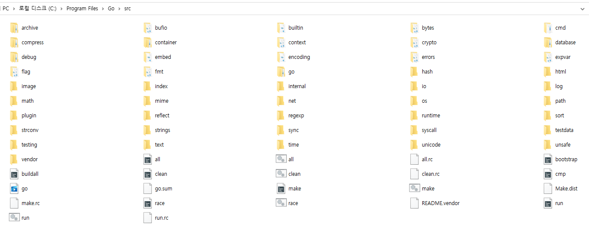

# 04 - Go Package

Go 언어가 어떻게 패키지를 관리하는지 알아봅시다. 🤹‍♀️

<br />

## 외부함수 호출하는 방법 #3

[참고 링크](https://github.com/Keunyoung-Jung/go-study-mysterico/issues/3)

<br />

## Go가 패키지를 관리하는 방법 (GOROOT / GOPATH)

### `GOROOT`

다음의 코드에서, `fmt` 패키지는 어디에서 가져오고 있는걸까?

```
package main

import "fmt"

func main() {
	fmt.Println("Hello, Go!")
}


```

<br />

정답은 GOROOT 아래의 `src` 디렉토리이다.
`go env` 명령어로 GOROOT 위치를 알 수 있으며,
이곳에는 fmt 외에도 log, net과 같이 기본적으로 제공하는 모듈들이 위치해 있다.
이 모듈들은 공식 문서의 [패키지 파트](https://golang.org/pkg/)에서도 볼 수 있다.

<br />



`import` 명령어는 지정된 디렉토리 내부에서 패키지를 찾는 명령어로, 그중에 `GOROOT/src`가 포함된다.

물론 `GOROOT`는 단순히 패키지 관리만을 하는 곳은 아니다. 오히려 일종의 SDK에 가깝다.
go를 실행하는 바이너리 파일과, 다른 환경(가령, [javascript와 같이 다른 언어로 된 프로젝트의 모듈로](https://m.blog.naver.com/sory1008/221794436126))에서 동작할 수 있게 하는 등의 다양한 라이브러리 등을 함께 포함한다. 그러므로 패키지를 추가하고 싶다고 해서 모든 go 프로젝트를 관할하는 `GOROOT/src`에 내가 원하는 패키지를 넣는 것은 그다지 바람직하지 않은 방법이다.

그렇다면 외부 패키지를 저장할 경로를 필요로 하는데, 그곳이 `GOPATH`이다.

<br />

### `GOPATH`

`GOPATH`는 외부 패키지의 모듈을 종합적으로 관리하는 곳이다.
모듈을 설치하면 메인 디렉토리를 기준으로 모듈의 소스 파일이 저장된다.

써드파티 패키지를 통해 `GOPATH`가 어떻게 동작하는지 확인해보도록 하자.
간단히 `HTTP status`에 따른 log를 출력하는 프로그램을 만들어볼 것이며,
[logrus](https://github.com/sirupsen/logrus)라는 패키지를 사용할 것이다.

[프로젝트](example/without-modules/main.go)

<br />

### 실행 방법

`go get -d "github.com/sirupsen/logrus"`로 logrus 모듈을 `GOPATH/src`에 설치한다.
(이때, 저장 위치는 `GOPATH/pkg/mod/github.com/{작성자}/{패키지명}@{버전}`이 된다.)

---

<br />

다음엔 간단한 커스텀 패키지를 만들어서 `GOPATH`의 동작 방식을 확인해보자.
실행한 환경의 OS를 출력해주는 간단한 프로그램이다.

이때, 주의해야 할 점이 있는데, 외부에서 참조할(즉, 패키지로 사용할 함수) 함수는 반드시 대문자로 시작해야 한다.

프로젝트
[main 파일](example/src/custom.go)
/
[pkg 파일](example/src/custom/cuspkg.go)

<br />
<br />

### 그렇다면?

**Q1**. 설치된 logrus 모듈은 몇 버전을 사용하고 있는가?

**Q2**. 만일 다른 버전을 사용하고 싶다면 어떻게 해야할까?

**Q3**. A 프로젝트에서 버전 `v1.0.0`을 사용했다. 그러나 B 프로젝트에서 `v1.7.1`을 사용해야만 한다. 그럼 어떻게 해야할까?

<br />
<br />

.

.

.

.

.

.

<br />
<br />

**A1**. `logrus`는 최신 버전(2022.01.10 기준 `v1.8.1`)의 패키지를 받아온다. 이는 해당 링크의 `master repository`에서 가장 최신 버전의 tag를 받아오기 때문이다.

(물론 github에서만 패키지를 받아오는 것은 아니다. 다양한 환경에서 package를 받아올 수 있다.)

**A2**. `go get` 명령어는 버전 단위의 다운로드를 지원한다. `go get github.com/sirupsen/logrus@v1.0.1` 등의 명령어를 사용하면 된다.

**A3**. `GOPATH`는 환경변수이다. 즉, 변경 가능하다는 의미이다. 디렉토리 내부에 `bin`/`pkg`/`src`의 디렉토리가 갖춰지면 정상적으로 동작이 가능하다.

<br />

### 어떤 점이 불편한가?

1. 하나의 워크스페이스(GOPATH)가 모든 프로젝트의 패키지를 관리해야하는 구조이다. 의존성 관리 중 충돌이 발생하거나 각각의 패키지가 서로에 영향을 끼치는 경우가 발생할 수 있다.
2. `GOPATH`가 변경 가능하다고 하더라도, 여러 개의 프로젝트를 진행하며 매번 환경변수를 바꿔야하는 번거로움은 적절한 의존성 관리라고 할 수 없다.
3. 작성자가 버전을 기술해주지 않는 이상 정확한 버전 관리가 이루어지지 않는다. 다른 개발자가 코드를 이어받았을 때 그 버전에 대해 알 수 없다는 점은 코드 관리에 치명적이다.

<br />

### 다른 곳은 어떻게 이런 문제를 관리할까??

1. `SpringBoot`, `Node.js`, `Flutter`와 같은 언어/프레임워크는 하나의 프로젝트에 대하여 의존성 관리와 프로젝트 정의를 위한 파일을 가지고 있다(`build.gradle`등.., `package.json`, `pubspec.yaml`).
2. 이와 같은 문서를 통해 프로젝트에 대해 적절한 의존성과 버전을 확인할 수 있고 바로 설치할 수도 있다(물론 다음 프레임워크들은 모두 중앙 저장소를 가지고 있긴 하다).

<br />

### 이런 문제를 어떤 식으로 해결하려 했을까?

1. 일일이 `GOPATH`를 변경해가며 프로젝트를 작성한다.
2. 벤더링을 통해 버전 일관성 문제를 해결한다.
3. 도커 이미지 등에 GO 환경을 구축해 활용한다.
4. *go-modules*를 활용한다.

---

<br />
<br />

## `go.mod`

go가 이런 문제에 의해 `v1.11`부터 지원하기 시작한 것이 `go-modules`이다. `v1.16`부터 표준이 되었다. `mod`는 `modules`의 약자로, `go-modules`를 활용하기 위한 파일이다.

```
module sample
go 1.16
require (
	github.com/aliyun/aliyun-oss-go-sdk v2.0.5+incompatible
	github.com/artdarek/go-unzip v0.0.0-20180315101617-33dc05190e4b
	github.com/asaskevich/govalidator v0.0.0-20200108200545-475eaeb16496
	github.com/baiyubin/aliyun-sts-go-sdk v0.0.0-20180326062324-cfa1a18b161f // indirect
	github.com/extrame/ole2 v0.0.0-20160812065207-d69429661ad7 // indirect
	github.com/go-sql-driver/mysql v1.5.0
	github.com/go-xorm/xorm v0.7.9
	github.com/golang/freetype v0.0.0-20170609003504-e2365dfdc4a0
	github.com/labstack/echo v3.3.10+incompatible
	github.com/pangpanglabs/echoswagger v1.1.0
	github.com/pangpanglabs/goutils v0.0.0-20200116103626-3f9fcfaa29b0
	github.com/sergeilem/xls v0.0.1
	github.com/tealeg/xlsx v1.0.5
	github.com/urfave/cli v1.22.2
	golang.org/x/image v0.0.0-20200119044424-58c23975cae1
)
```

<br />
<br />

## `go-modules`는 어떤 식으로 동작할까?

`go.mod`를 사용하지 않는 환경에서 `go`는 단순히 지정된 루트를 훑는 것으로 패키지를 인식한다.
바로 `GOPATH`와 `GOROOT`이다.

앞에서 말한 문제들은 `Go-modules`를 통해 대부분 해결이 될 수 있다.

`Go-modules`는 패키지를 트리 형식으로 저장하며, 루트 트리에는 반드시 `go.mod` 파일을 필요로 한다.

이제 `go.mod`가 존재하는 디렉토리 내부에서 파일이 실행된다면 go는 이제 `go.mod`의 이름을 가지고 패키지를 추가로 모색하기 시작한다.

<br />
<br />

## Go-modules의 이점

1. 버전 관리가 용이해지며, 프로젝트 당 하나의 `go.mod`로 관리되기 때문에 의존성 간의 충돌이 일어날 확률이 낮아진다.
2. github에 코드를 올린 경우에도 `go.mod` 파일을 통해 제3자도 의존성 및 버전을 확인하고 바로 설치할 수 있다.

<br />
<br />

## `Go-modules`를 활용해 써드파티 패키지를 관리해보자

[프로젝트](https://github.com/yesyeseo/Golang-Study/tree/ottl-seo/%5B16%5D%20Package/usepkg)

<br />

---

## 참고 자료

https://go.dev/doc/

https://go.dev/blog/using-go-modules

https://www.jetbrains.com/help/go/configuring-goroot-and-gopath.html

https://pronist.tistory.com/86

https://korband.tistory.com/23

https://jbhs7014.tistory.com/182

https://www.digitalocean.com/community/tutorials/understanding-the-gopath

https://wookiist.dev/90

https://stackoverflow.com/questions/10383498/how-does-go-update-third-party-packages

https://www.popit.kr/%EA%B3%A0-%EB%AA%A8%EB%93%88%EC%9D%84-%EC%82%AC%EC%9A%A9%ED%95%98%EC%97%AC-%ED%8C%A8%ED%82%A4%EC%A7%80-%EA%B5%AC%EC%84%B1-%EB%B0%A9%EB%B2%95-%EA%B0%9C%EC%84%A0%ED%95%98%EA%B8%B0/

https://thebook.io/006806/ch06/04/02_02/

http://golang.site/go/article/15-Go-%ED%8C%A8%ED%82%A4%EC%A7%80

https://blogs.halodoc.io/go-modules-implementation/

https://github.com/yesyeseo/Golang-Study/tree/ottl-seo/%5B16%5D%20Package
