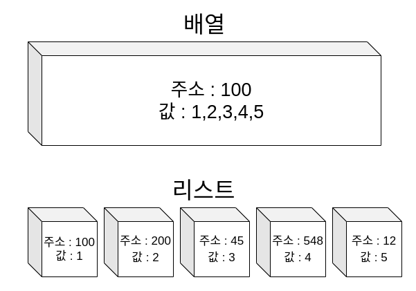

# 05 Data types
이번 장에서는 데이터 타입에 대해서 설명합니다.

## Boolean
* true
* false
```Go
b1 := true
```

## Integer
* int, uint (int,uint 만 쓰는 경우 머신의 비트에 따름)
* int8, uint8
* int16, uint16
* int32, uint32
* int64, uint64
* byte (== uint8)
* rune (== int32)
* uintptr (== uint / 포인터를 저장할때 사용)
```Go
a := 365    // 10진수
b := 0555   // 8진수
c := 0x160  // 16진수
```

## Float
* float32
* float64
```Go
a := 4.12
b := 1.2345e-3
```

## Complex
* complex64
* complex128
```Go
a := 1+2i
b := complex(5,6)
```

## Math function
수학함수는 너무너무 많아서 자주 쓸만한 함수는 아래와 같다.
* math.Cos(x)
* math.Dim(x)
* math.Sqrt(x)

## Struct and Map
Go언어에는 Struct와 Map이라는 구조체를 사용한다.
* map은 해시테이블 구조로 key와 value의 type이 고정되어 있다.
* struct는 자유롭게 value의 type이 선언 가능한 type이다.
```Go
x := map[string]int{
    "first":1,
    "second":2
}

type Person struct {
    name string
    age int
}

y := Person{"철수",10} 
```

## Pointer
포인터는 C언어에서 배웠던 개념이다.    
프로그래밍에서는 변수를 선언하면, 공간을 할당하고 해당 공간 주소에 변수에 선언한 value를 저장한다.   
예를 들어, `x=50` 이라는 변수를 생성하면 변수가 `2000`번 주소에 저장이 된다고 가정하자.   
그렇다면 메모리 공간에는 

|주소|값|
|--|--|
|2000|50|
   
같은 해시테이블 구조로 변수를 저장하게 되고, 우리는 `2000`번의 주소를 통해 직접 접근이 가능해진다.
```Go
package main

import (
	"fmt"
)

func main() {
	x := 50
	y := &x
	fmt.Println(&x,":",x)
	fmt.Println(&y,":",y)
	fmt.Println(&*y,":",*y)
	*y = 100
	fmt.Println("----*y = 100 선언----")
	fmt.Println(&x,":",x)
}

```
Output
```
0xc0000160c0 : 50
0xc00000e028 : 0xc0000160c0
0xc0000160c0 : 50
----*y = 100 선언----
0xc0000160c0 : 100
```

포인터는 함수, 변수 모두 사용 가능하므로 필요에 따라 사용할 수 있다.   
python에 포인터가 있진 않지만 python을 통해서 간접적으로 포인터의 존재를 느낄 수 있다.
```python
import copy

x = [1,2]
y = x
z = copy.deepcopy(x)

print(id(x),":",x)
print(id(y),":",y)
print(id(z),":",z)

x.append(3)
print("---x.append(3) 선언---")

print(id(x),":",x)
print(id(y),":",y)
print(id(z),":",z)
```
Output
```
140508314593728 : [1, 2]
140508314593728 : [1, 2]
140508314591872 : [1, 2]
---x.append(3) 선언---
140508314593728 : [1, 2, 3]
140508314593728 : [1, 2, 3]
140508314591872 : [1, 2]
```
## Arrays and Slices
Go에는 배열과 슬라이스가 있다.   
* 배열은 길이가 지정되어있는 변수들의 나열
* 슬라이스는 길이가 지정되어있지 않은 (동적할당) 변수들의 나열
```Go
x := [5]int{1,2,3,4,5} // 배열
y := []int{1,2,3,4,5} // 슬라이스
```
쉽게 말하면, 그냥 배열에서 length를 빼고 쓰는 것 ..

### 리스트와의 차이
Python은 Array가 없이 List만 사용하기 때문에 이를 간과하고 넘어갈 수 있다.   
배열과 리스트의 차이는 그림을 보면 쉽게 파악할 수 있다.   
   

   
위 그림 처럼 배열은 하나의 공간에 값이 저장되는 방식이고, 리스트는 여러개의 공간에 값이 저장되는 방식이다.   
그림에는 표현이 안되어있지만 하나의 리스트노드는 다음 노드의 주소를 가지고 있다. (연결성)

### Go에서는 쓸 수 없나요?
Go에서는 List를 지원하지 않기 때문에 직접 만들어서 쓰면된다.   
마침 포인터도 익힌김에 만들어봅시다.   
```Go
package main

import (
	"fmt"
)

type List struct{
	head *Node
	tail *Node
}

type Node struct {
	prev *Node
	index int
	value interface{}
	next *Node
}

func (list *List) First()(*Node){
	return list.head
}

func (list *List) Append(value interface{}){
	node := &Node{value: value}
	if list.head == nil {
		list.head = node
		list.head.prev = nil
		list.head.index = 0
	} else {
		list.tail.next = node
		node.prev = list.tail
		node.index = list.tail.index +1
	}
	list.tail = node
}

func (node *Node) Next()(*Node){
	return node.next
}

func (node *Node) Prev()(*Node){
	return node.prev
}


func main() {
	list := List{}
	list.Append([]int{1,2})
	list.Append("hello")
	list.Append(1.5)

	fmt.Println("{ prev   index   value   next       }")
	firstNode := list.First()
	fmt.Println(*firstNode)
	nextNode := firstNode.Next()
	fmt.Println(*nextNode)
	nextNode2 := nextNode.Next()
	fmt.Println(*nextNode2)

	fmt.Println("세번째 노드에서 이전으로 돌아가기")
	prevNode := nextNode2.Prev()
	fmt.Println(*prevNode)
}
```
Output
```
{ prev   index   value   next       }
{<nil>        0 [1 2]   0xc00007c180}
{0xc00007c150 1 hello   0xc00007c1b0}
{0xc00007c180 2 1.5     <nil>       }
세번째 노드에서 이전으로 돌아가기
{0xc00007c150 1 hello   0xc00007c1b0}
```

### 사실은 ..
눈치 빠른사람은 알겠지만 타입에 상관없는 배열을 만들고 싶은게 목적이라면 그냥 아래처럼 선언하면 된다.
```Go
s := []interface{}{1, 2, "three", SomeFunction}
```

## interface 란?
Go 언어에는 interface라는 객체를 다룰 수 있다.
struct처럼 타입을 지정해서 interface객체로써 사용하거나, javascript의 Any type처럼 사용할 수 있다.
```Go
type Member interface{
    id int
    email string
}
```