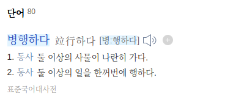
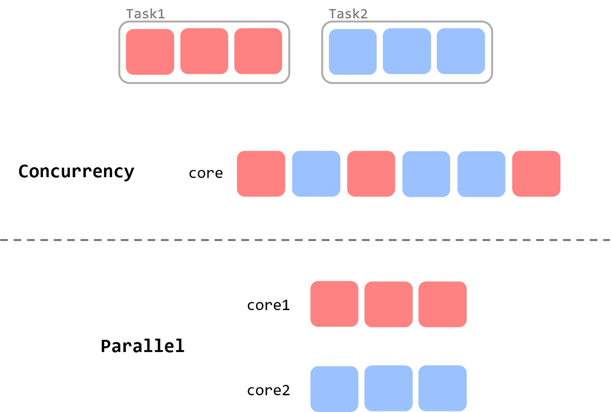
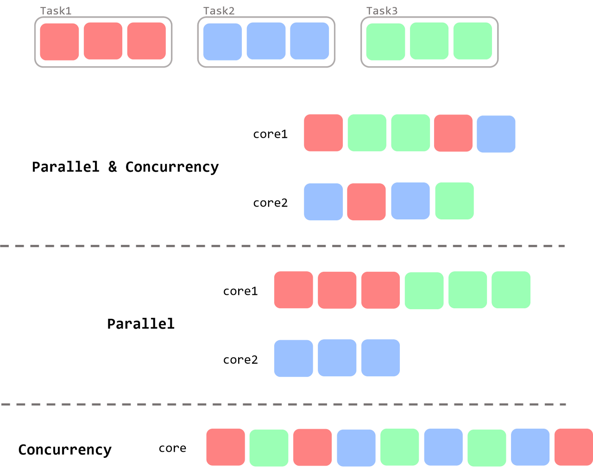
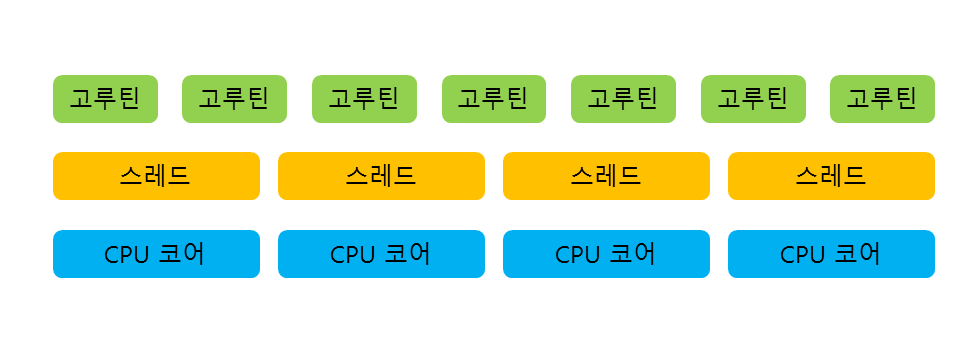
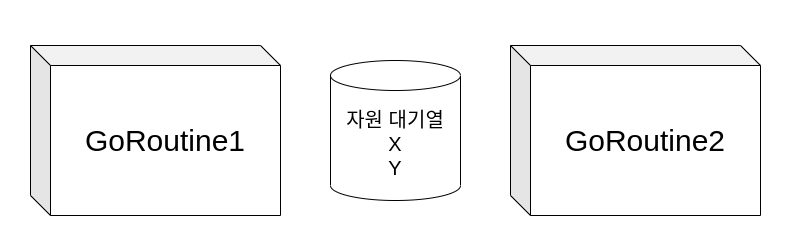
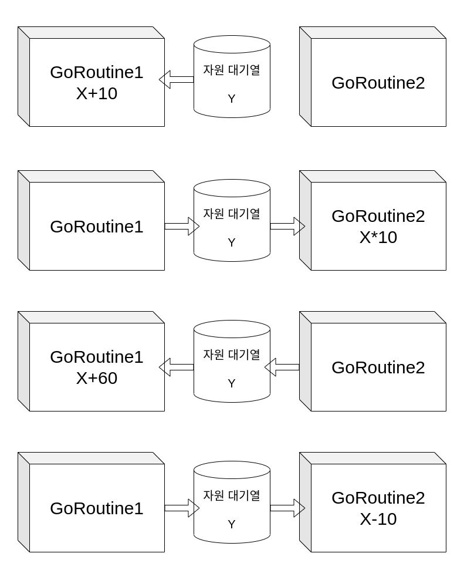

# 06 Concurrency
이번 장에서는 병행성에 대해 설명합니다.
## 병행성 vs 병렬성
병렬성 (Parallelism)과 병행성(Concurrency)는 비슷한듯 다른 친구들이다.   
먼저, 한글에서의 뜻을 봅시다.   
   



   
`병행하다`는 행위로써 어떤 일을 한번에 행하는 것을 뜻하고,
`병렬적`은 나란이 놓여있는 상태를 뜻한다.   
즉, `병행하다`는 어떤 행위, `병렬적`은 어떤 상태라고 볼 수 있다.
    
이는 영단어에서 뜻을 더 확연히 이해할 수 있다.   
`Concurrency` 는 동시 실행을 뜻하는 논리적인 단위로 볼 수있고,    
`Parallelism` 는 평행을 뜻하기 때문에 물리적으로 평행한 상태를 뜻한다.   
   


위 그림에서 보이듯이 `Concurrency(병행)`은 그냥 2가지의 일을 동시에 작업하는 것.   
`Parallelism(병렬)`은 물리적 공간에 평행한 상태로 놓여진 것이 확인된다.   

`Concurrency(병행)`은 논리적인 행위를 뜻하기 때문에 당연히 `Parallelism(병렬)`한 상태로 작업하는 것도 `Concurrency(병행)`한다고 표현할 수 있다.    
(`Concurrency(병행)` ⊃ `Parallelism(병렬)`)

   
### 뭐가 더 빠를까요?
일반적으로 Python에서 실행되는 작업은 Concurrency를 뜻하고, Java에서는 Parallel을 뜻한다.   
뭐가 더 빠르다는 절대적인 답은 없고, 단순히 컴퓨터 자원에 영향을 받는다.
위 그림2 처럼, task가 3개인데 core가 2개인 컴퓨터에서 병렬로 처리하면 Spend time이 Concurrency보다 길어지게 되고, 그림1처럼 core를 다르게 사용한다면 병렬이 빠를 수 있다.

## 병행성의 난제
병행성 중에서 Multi Core 환경에서 Thread를 사용하는 상황을 생각해본다.   
일반적으로 Thread는 OS에서 관리하기 때문에 Thread 변경에서 일어나는 상황인 `컨텍스트 스위치(Context Switch)`에 대해 대처하기 힘들다.   
`컨텍스트 스위치(Context Switch)` 가 빈번하게 일어날 수록 실제 하나의 프로그램이 사용하는 것보다, CPU와 RAM사용량이 급격하게 증가한다.    

## 조금은 다른친구 Go Routine
Go Routine은 Go언어의 핵심이 되는 기능이다. (사실상 이거하려고 Go언어를 사용함)
   

   
Go Routine 은 Thread보다 작은 단위로써 동작한다.   
이를 가능하게 하는 이유는 Go Routine은 Parallel하게 동작하는게 아니라 Concurrency하게 동작하기 때문이다.   
쉽게 말하면, Python에서는 GIL이 걸려 있기 때문에 Time-Sharing을 통해 동시성을 해결한다.   
Go Routine또한 Time-Sharing을 통해서 동시성을 해결하기 때문에 OS에서 관리하는 Thread를 직접적으로 사용하지않고, 가상 Thread를 만들어서 사용할 수 있게 되었다.   
   
Go Routine을 사용하는 방법은 굉장히 간단하다.
```Go
package main

import (
    "fmt"
    "math/rand"
    "time"
)

func hello(n int) {
    r := rand.Intn(100)
    time.Sleep(time.Duration(r)) 
    fmt.Println(n)
}

func main() {
    for i := 0; i < 100; i++ {
        go hello(i) // 요 부분
    }
}
```
단순히 `go someFunction()`만 하면 반복하여 작업하는 것을 동시성을 가지고 작업을 한다.   
위 예제는 100회 반복문이므로, Go Routine도 100개 생성되어 처리한다.   

## 그럼 Python과 같은 병행성인데 왜 Go Routine이 Thread 사용보다 빠른가요?
Go Routine이 가지는 동시성이 빠른 이유는 아래와 같다.
* 병렬이아닌 병행이므로 ContextSwitch가 현저히 낮다.
* 원래 Thread는 리소스를 배치하는것과 반환하는것에 대한 비용이 크다.
    * Java에서는 1MB의 스택 공간과 Thread간의 보호공간인 Guard page가 요구된다.
    * Go Routine은 2KB의 스택공간으로 Heap을 통해 저장 공간을 확보한다.
* Go Routine은 GIL이 없고, Thread를 사용하여 멀티코어로써 동작도 가능하다.
* OS가 관리하는 것이 아닌 Go가 관리하는 Thread라고 볼 수 있다.

멀티코어를 활용하는 것도 간단하게 사용할 수 있다.   
```Go
package main

import (
	"fmt"
	"runtime"
	"time"
)

func main() {
	runtime.GOMAXPROCS(6) // 요고만 하면됨

	for i := 0; i < 100; i++ {
		go hello()
	}
}

func hello() {
	fmt.Println("hello")
}
```
### 무조건 빠를까?
그렇다면 그 좋다는 동시성이 반복문을 수행하는데 있어서 무조건 빠를까?   
정답은 `아니다` 이다.   
GoRoutine도 결국 가상의 Thread기 때문에 Pool을 생성해야하고,   
그에 따른 작은 대기시간들이 발생하게 된다.    
즉, 알고리즘 수행시간이 너무 짧다면 오히려 GoRoutine으로 Pool을 생성하는 시간으로 손해를 볼 수 있다.   
(결국은 수행시간을 한번 체크해보는게 좋다.. 단순 for문이 빠를 수도 있음)

## 공유 자원
병행성이 보장되는 프로그래밍에서 가장 중요한게 무엇인지 생각해보면 바로 공유자원이다.   
만약 공유자원을 제대로 관리안한다면, 동시성 프로그래밍은 망가질 수 밖에 없다.   


   
위와 같은 상황이고 X의 초깃값은 0 최종 결과값을 150을 얻고 싶다고 가정해보자.   
* 1번이 X에 10을 더하기
* 2번이 10을 곱하기
* 1번이 60을 더하기
* 2번이 10을 빼기
위와 같은 과정을 통해 결과값을 150을 얻는다고 치면,   
해당 공유자원에 대해서 제어를 해주지 않는다면 수행결과가 동시성에 따라 다를 수 있다.
* 2번이 10을 먼저 빼고, 10을 곱해버려서 -30이 반환
* 2번이 10을 먼저 곱하고, 수행되어서 80을 반환
이러한 오류가 생길 수 있기 때문에, 동시성 프로그래밍에서는 공유자원관리가 중요할 수 밖에 없다.

## Go Routine의 Channel
Go 언어 에서는 Channel을 통해 공유자원을 관리한다. (뮤텍스 함수도 있음)   
이는 Go Routine간의 통신이 가능하게 해주는 부분이다.   
    

    
**(동시성 프로그래밍에서 트랜젝션의 제어용도로 사용해야하지 이렇게 흐름제어를 하려고하면 안됨! 채널 설명을 위해 이렇게 작성되었음!)**
```Go
package main

import "fmt"

func routine1(channel chan int){
	x := <- channel
	fmt.Println(x)
	if x == 0 {
		channel <- x+10
	} else {
		channel <- x+60
	}
}

func routine2(channel chan int){
	x := <- channel
	fmt.Println(x)
	if x == 10 {
		channel <- x*10
	} else {
		channel <- x-10
	}
}

func main() {
  // 채널 생성
	myChannel := make(chan int)
	go func(){
		x := 0
		myChannel <- x
		} ()
	go routine1(myChannel)
	go routine2(myChannel)
	go routine1(myChannel)
	go routine2(myChannel)
	fmt.Scanln()
	x := <- myChannel
	fmt.Println(x)
}
```
Output
```
0
10
100
160
150
```
(채널을 써보려고 작성한거라 그런지 해당 코드에는 버그가 있음 .. ㅜㅜ)

### Wait Group
Go Routine이 전부 끝나지 않고 프로그램이 끝나는 경우가 있기 때문에 대기열을 사용하여 대기시켜준다.   
```Go
wg := new(sync.WaitGroup)
wg.Add(1)
wg.Done()
wg.Wait()
```
